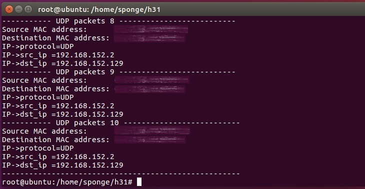
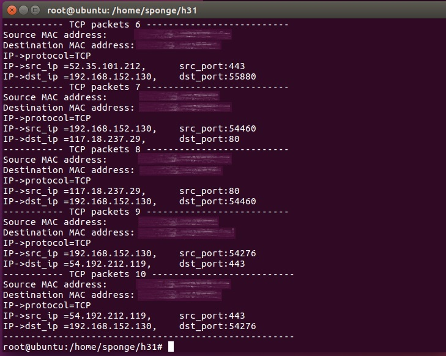

# TCPIP-RawSocket-Sniffer

在TCP/IP架構中，通訊位址相關訊息是攜帶在封包表頭(header)，各層有與之對應的header資訊，其餘為資料內容(payload)。

經過層層解封裝後，接收到的即是資料本身；像是一般常用的通訊協定(protocol)，如TCP、UDP等等，最終用戶應用端即是接收到這種除去header的資料。但是若想觀察完整網絡封包的攜帶資訊，其中一種方法是使用原始通訊端(raw socket)實現封包嗅探器(sniffer)。

 
  
(**其他種類socket** 與 **raw socket** 差異)

在此於Linux環境下實作raw socket sniffer，總計三項目。

* [累計嗅探100次網路中傳遞之封包並作protocol統計](#累計嗅探100次網路中傳遞之封包並作protocol統計)
	* 建立raw socket
	* 設定網路卡
	* 從各層header抓取protocol資訊
* [嗅探特定協定種類封包-UDP](#嗅探特定協定種類封包-UDP)
* [針對TCP累計嗅探10次，並印出該封包的MAC、IP與port資訊](#針對TCP累計嗅探10次，並印出該封包的MAC、IP與port資訊)

執行row socket需要root權限操作。

## 累計嗅探100次網路中傳遞之封包並作protocol統計

### 建立raw socket

<span id = "socket"></span>
使用 `socket()` 創建。

```c
sock = socket(PF_PACKET, SOCK_RAW, htons(ETH_P_ALL))

int socket(int domain, int type, int protocol);
```

#### domain

有PF_字首(Protocol Families)與AF_字首(Address Families)，現今函式庫註解中明確提及這兩者用法相同。

另常見 _PACKET、 _INET與 _INET6這幾項； _INET與 _INET6分別代表IPv4與IPv6協定。  
在此使用 _PACKET使socket能直接讀取傳輸層(data link layer)資訊。


#### type

大多有在使用的幾項，如SOCK_STREAM (TCP)、SOCK_DGRAM (UDP)與SOCK_RAW這幾個。

#### protocol

這一項設成0，則會默認使用的對應type之協定。而此處的目的是嗅探所有網路上的封包，故設為htons(ETH_P_ALL)將會接收所有封包。

<span id = "htons"></span>
這裡 `htons()` 是用來處理位元組順序(byte order)議題。

|函數| |
|---|:---:|
|htonl( )|Host to Network Long|
|htons( )|Host to Network Short|
|ntohl( )|Network to Host Long|
|ntohs( )|Network to Host Short|

網路位元組序(Network Byte Order)只有單純一種，是採用Big-endian。  
主機位元組序(Host Byte Order)，有兩種；常見如在Intelx86 CUP的主機是Little-Endian，其他的則是Big-endian。

### 設定網路卡

<span id = "ioctl"></span>
使用raw socket進行嗅探，須將網路卡(network interface controller，NIC)設為混雜模式(promiscuous mode)。  
對NIC進行控制需要以系統root權限進行，並利用 `ioctl()` 操作NIC以控制flag。

其中flag修改成promiscuous mode時是以 `|=` 運算進行。

### 從各層header抓取protocol資訊

#### data link layer

由data link layer開始逐步對header內資訊解析。


<span id = "etherheader"></span>
關注的ether_header程式碼如下。

```c
struct	ether_header {
	u_char	ether_dhost[ETHER_ADDR_LEN];
	u_char	ether_shost[ETHER_ADDR_LEN];
	u_short	ether_type;
};
```

此處 `ether_type` 即是紀錄了為何種協定。  
我們的目標為IP(*ETHERTYPE_IP*)、ARP(*ETHERTYPE_ARP*)與RARP(*ETHERTYPE_REVARP*)三項。

#### network layer

<span id = "ipheader"></span>
接下來對網路層(network layer)之ip header進一步分類。完整的ip header如下。

```c
struct ip {
#if BYTE_ORDER == LITTLE_ENDIAN 
	u_char	ip_hl:4,		/* header length */
		ip_v:4;			/* version */
#endif
#if BYTE_ORDER == BIG_ENDIAN 
	u_char	ip_v:4,			/* version */
		ip_hl:4;		/* header length */
#endif
	u_char	ip_tos;			/* type of service */
	short	ip_len;			/* total length */
	u_short	ip_id;			/* identification */
	short	ip_off;			/* fragment offset field */
#define	IP_DF 0x4000			/* dont fragment flag */
#define	IP_MF 0x2000			/* more fragments flag */
	u_char	ip_ttl;			/* time to live */
	u_char	ip_p;			/* protocol */
	u_short	ip_sum;			/* checksum */
	struct	in_addr ip_src,ip_dst;	/* source and dest address */
};
```

目的是要記錄統計為協定種類，故關注 `ip_p` 這項。  
目標找出TCP(*IPPROTO_TCP*)、UDP(*IPPROTO_UDP*)、ICMP(*IPPROTO_ICMP*)與IGMP(*IPPROTO_IGMP*)。

### 執行結果

如此可進行嗅探100次封包，並對上述七項協定進行統計。


其中TCP、UDP、ICMP、IGMP是以IP header封裝。

## 嗅探特定協定種類封包-UDP

針對ip packet擷取某特定協定封包，在此使用的方法是讀取 `ip_p` 來判定是否為目標。

而使用raw socket讓我們能讀取完整UDP封包攜帶的傳遞訊息。  
包含紀錄在Frame的來源/目的MAC address(*ether_shost/ether_dhost*)，以及ip header內之來源/目的ip(*ip_src/ip_dst*)。

<span id = "inet"></span>
`inet_ntoa()` 用來將header內以二進制形式攜帶的ip_src/ip_dst等資訊轉換為我們易讀的IPv4點式十進制表示法(dotted-decimal notation)。

### 執行結果-UDP



## 針對TCP累計嗅探10次，並印出該封包的MAC、IP與port資訊

由本篇前面敘述可逐步抓取封包MAC address與ip address。

<span id = "tcphdr"></span>
接著，欲獲得TCP的port訊息，需進一步擷取位在傳輸層(transport layer)的 `tcphdr` 攜帶資訊。

#### transport layer

關注source port以及destination port這兩項。

```c
struct tcphdr {
	u_short	th_sport;		/* source port */
	u_short	th_dport;		/* destination port */
    ...
};
```

### 執行結果-TCP封包



---

### index

[`socket()`](#socket "socket() from <sys/socket.h>")  [`htons()`](#htons "htons() from <arpa/inet.h>")  [`ioctl()`](#ioctl "ioctl() from <sys/ioctl.h>")  [`inet_ntoa()`](#inet "inet_ntoa() from <arpa/inet.h>")

[`ether_header`](#etherheader "ether_header from <net/ethernet.h>")  [`ip`](#ipheader "ip from <netinet/ip.h>")  [`tcphdr`](#tcphdr "tcphdr from <netinet/tcp.h>")  
